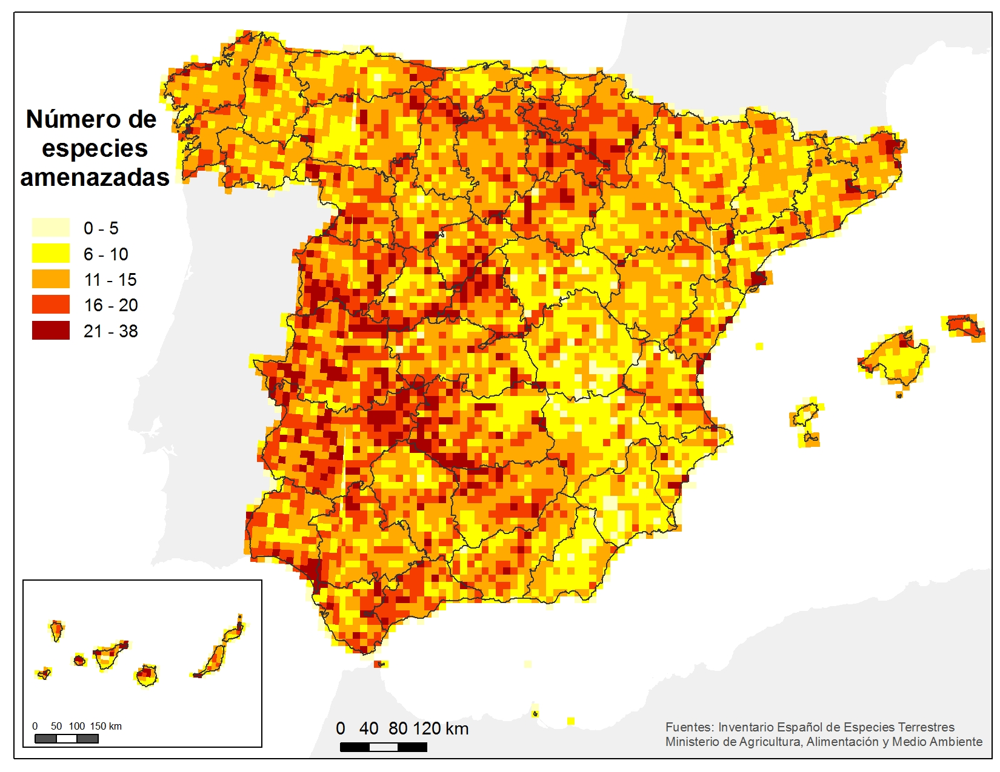

## 🚀 Potencial Aporte

- **Identificación automatizada** de especies amenazadas a partir de datos confiables y actualizados.
- **Análisis en tiempo real** sobre el impacto del cambio climático en hábitats naturales, cruzando información climática y ecológica.
- **Visualización interactiva** con mapas que muestran zonas de distribución y nivel de amenaza, facilitando la comprensión para diversos públicos.
- **Soporte para la toma de decisiones**, permitiendo a gobiernos, ONGs y centros de investigación enfocar esfuerzos de conservación basados en datos.

---

## 🌍 Relevancia del Proyecto

- **Contexto actual de crisis ecológica:** En un momento crítico de pérdida acelerada de biodiversidad, contar con herramientas tecnológicas que integren y comuniquen información actualizada es vital para proteger el equilibrio ecológico.
- Promueve el **uso de tecnologías sostenibles**, demostrando cómo la programación y el análisis de datos pueden ser aliados de la conservación ambiental.

## 🌿 Objetivos y productos finales 🌿

Los objetivos de este proyecto se dividen en dos partes:

### 🐼 Objetivo general

Se busca utilizar herramientas digitales para la **recolección**, **análisis** y **visualización de datos** sobre **especies en peligro de extinción**, relacionando esta información con **reportes noticiosos** y **eventos climáticos** que afectan críticamente sus hábitats.  
El fin último es **generar conciencia ambiental** y contribuir a una **toma de decisiones informada** frente a la pérdida de biodiversidad.

---

### 🐼 Objetivos específicos

- **Recolectar información** desde fuentes confiables, como la **Lista Roja de la UICN**, portales climáticos y bases de datos de biodiversidad.
- **Detectar noticias recientes** que informen sobre la **pérdida de hábitats** o **amenazas directas** a especies en peligro.
- **Analizar la relación** entre el **cambio climático** (temperaturas extremas, sequías, incendios) y la **reducción de los ecosistemas naturales**.
- **Visualizar geográficamente** las especies afectadas y su nivel de amenaza mediante **mapas interactivos**.
- **Desarrollar un dashboard interactivo** que permita al usuario **explorar la información por especie, región o tipo de amenaza**, en un entorno accesible y comprensible.

---

## 🌿 Resultado final del proyecto 🌿

Con el proyecto se busca un sistema funcional capaz de:

- **Consultar múltiples APIs** de datos ambientales y noticiosos de forma automatizada.
- **Detectar menciones** de especies y amenazas relevantes en medios de comunicación.
- **Generar un mapa interactivo** que muestre la distribución de especies amenazadas, filtrable por país, especie o tipo de riesgo.
- **Presentar la información** en una **interfaz web amigable**, enfocada en el usuario, con énfasis en la **comunicación visual**, dejando de lado tecnicismos innecesarios.
- **Contribuir a la concientización** y **sensibilización de la comunidad** mediante la presentación **clara, visual y accesible** de datos críticos sobre la biodiversidad global.
